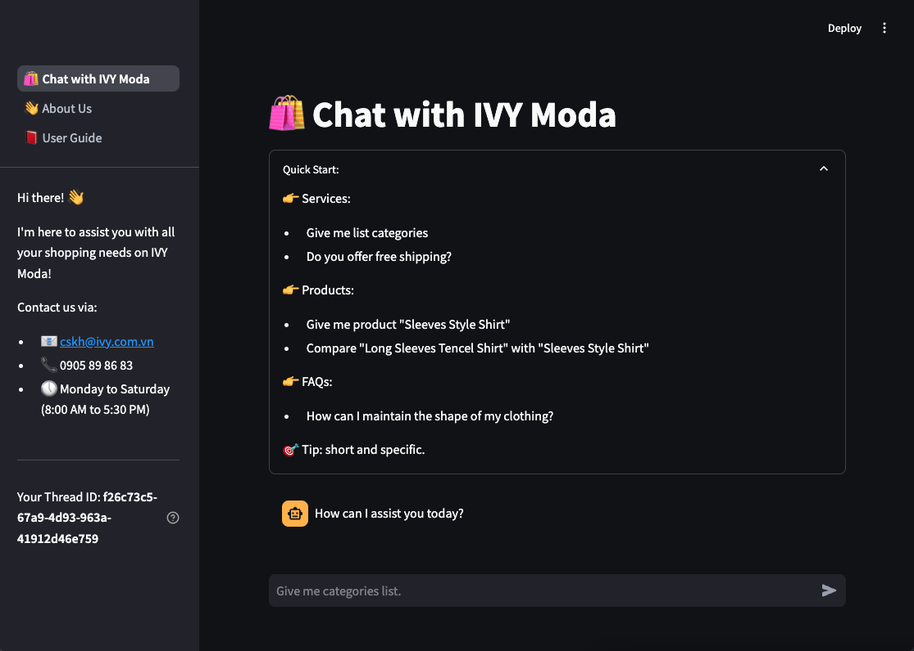

# 🛍️ Chat IVY Moda

This repo is an implementation of a chatbot specifically focused on question answering over the [IVY Moda website](https://ivymoda.com/).
Built with [LangChain](https://github.com/langchain-ai/langchain/), [LangGraph](https://github.com/langchain-ai/langgraph/), and [Streamlit](https://streamlit.io/).



Deployed version: (coming soon)

## Prerequisites
- [uv](https://docs.astral.sh/uv/)
- [pre-commit](https://pre-commit.com/)
- [make](https://www.gnu.org/software/make/)

## 🔑 Tech Stack
- Python
- LangChain
- LangSmith
- LangGraph
- LangServe
- Streamlit.io
- Promptfoo
- OpenAI models:
  - Chat model: `gpt-4o-mini`
  - Embedding model: `text-embedding-3-small`

### Tech Stack Introduction
- Language
  - [Python](https://www.python.org/): Python is a programming language that lets you work quickly and integrate systems more effectively.
- Framework
  - [LangChain](https://langchain.com/): LangChain’s flexible abstractions and AI-first toolkit make it the #1 choice for developers when building with GenAI.
  - [LangSmith](https://www.langchain.com/langsmith): LangSmith is an all-in-one developer platform for every step of the LLM-powered application lifecycle, whether you’re building with LangChain or not. Debug, collaborate, test, and monitor your LLM applications.
  - [LangGraph](https://www.langchain.com/langgraph): Gain control with LangGraph to design agents that reliably handle complex tasks. Build and scale agentic applications with LangGraph Platform.
  - [LangServe](https://python.langchain.com/docs/langserve): LangServe helps developers deploy LangChain runnables and chains as a REST API. This library is integrated with FastAPI and uses pydantic for data validation.
- Library
  - [Streamlit.io](https://streamlit.io/): A faster way to build and share data apps. Streamlit turns data scripts into shareable web apps in minutes. All in pure Python. No front‑end experience required.
  - [Promptfoo](https://www.promptfoo.dev/): Test & secure your LLM apps
- Vector Store
  - [Chroma](https://docs.trychroma.com/): Chroma is the AI-native open-source vector database. Chroma makes it easy to build LLM apps by making knowledge, facts, and skills pluggable for LLMs.
    - [LangChain integrate with Chroma](https://python.langchain.com/docs/integrations/vectorstores/chroma/)
- Deployment (optional)
  - [AWS Copilot CLI](https://aws.github.io/copilot-cli/): AWS Copilot is an open source command line interface that makes it easy for developers to build, release, and operate production ready containerized applications on AWS App Runner, Amazon ECS, and AWS Fargate.

## 🛠️ Tools
- [uv](https://docs.astral.sh/uv/): Python package manager
- [pre-commit](https://pre-commit.com/): Git hooks
- [ruff](https://github.com/astral-sh/ruff): Python linter
- [langchain-cli](https://python.langchain.com/docs/langchain-cli/): LangChain CLI
- [remote-pdb](https://github.com/jupyter/remote-pdb): Remote debugger
- [LangGraph Studio](https://www.langchain.com/langgraph): LangGraph Studio is a tool for visualizing and debugging LangGraph graphs.
- [Docker](https://www.docker.com/): Docker is a platform for building, shipping, and running applications in containers. Require to run LangGraph Studio


## 📚 Setup
### ⬇️ Clone repo
- Clone repo with branch
  ```bash
  git clone git@gitlab.asoft-python.com:thanh.nguyen/llm-training.git -b feat/langchain-advanced-practice
  ```
- Access project folder
  ```bash
  cd llm-training/3-practice/3-5-chat-IVY-moda
  ```

### 📦 Init environment
- Install dependencies: `uv sync`
- Access virtual environment: `source .venv/bin/activate`
- Create a `.env`: `cp .env.example .env` and fill require environment variables
  ```bash
  OPENAI_API_KEY=
  LANGCHAIN_API_KEY=
  LANGCHAIN_PROJECT=
  ```
- Load env: `uv run server/scripts/load_env.py`

### 📚 Prepare data (only needs to be done once)
- Run `make create_knowledge_base`

### ✅ Running app
1. 🤖 Server App: `make run_server`

2. 🎉 Client App: `make run_client`

3. 🌸 Run LangGraph Studio (not ready)
   - Run Docker
   - Open `server` folder with LangGraphStudio


### 🔍 Debugging
- Check api docs `http://127.0.0.1:8080/docs`
- PlayGround: `http://localhost:8080/chat/playground/`
    - Test: `{"message": "hello", "thread_id": "3b4de725-586a-4e48-b824-41bdc3c18cf5"}`
- Run local graph: `uv run scripts/graph_local.py`
- Debug with tracer
  This debugger is used to debug python code run in promptfoo for example
  - Add trace in code:
    ```bash
    from remote_pdb import RemotePdb
    RemotePdb('127.0.0.1', 4444).set_trace()
    ```
  - Access the debugger:
    ```bash
    telnet 127.0.0.1 4444
    ```
  - Check port on use: `lsof -t -i:4444`
  - Kill process on port: `kill lsof -t -i:4444`

- Debug database: call db in `sql_tools.py`
```bash
print(db.run("SELECT * FROM Product LIMIT 2;"))
```

## Documents
- [Practice Document](https://docs.google.com/document/d/1e4VZgSR7-XfW75ErzyuG8BQai69LFmYv5pqOGj7s0OE)
- [Diagram](https://whimsical.com/llm-practice-FXQKsCa4VDeRMqkNnc9J2y@2bsEvpTYSt1HjAkUH64LpYtPFrf2AqCCnNz)
- [Slide Review](https://gamma.app/docs/Customer-support-chatbot-5dnee8e4n8r14pn)

## Authors
- Trainee: Thanh Nguyen
- Mentor: Cong Dang
- Supporters: Duc Pham, Hoang Tran
